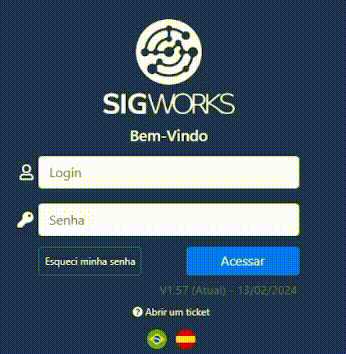

# Manual de Uso

Exibição da versão na tela de login e acesso ao histórico completo após o login.

> Introduzido na **v1.57**

## Exibição da versão na tela de login
Na tela de login do sistema, na parte inferior da interface, é exibido o número da versão atual do sistema.
Esse número é visível a qualquer usuário, mesmo sem autenticação.
Por que a informação é limitada nessa etapa?
> Como a tela de login é pública e pode ser acessada por qualquer pessoa, não são exibidos detalhes técnicos ou funcionais completos nessa área.

Essa decisão garante:
1. Maior segurança
2. Preservação de informações internas
3. Exposição apenas do que é estritamente necessário
4. Descrição rápida ao passar o mouse

Ao posicionar o cursor do mouse sobre o número da versão na tela de login, é exibida uma descrição breve da versão.
Essa descrição contém:
- Um resumo simples das principais mudanças
- Tópicos de alto nível, sem detalhes técnicos sensíveis
- O objetivo aqui é apenas informar o que mudou, não como funciona internamente.

## Acesso ao histórico completo após o login

Após a autenticação no sistema, o usuário passa a ter acesso ao Histórico de Versões completo.
No canto superior direito da aplicação, foi adicionado um ícone de versões (branches).
Esse ícone centraliza todas as informações relacionadas às versões do sistema.

### Lista de versões disponíveis

Ao clicar no ícone de versões, o sistema exibe:
1. A lista de todas as versões disponíveis
2. Organização clara e cronológica
3. Identificação visual da versão atual
4. Cada versão pode ser selecionada individualmente para consulta.
5. Acesso à documentação da versão
6. Dentro da visualização de uma versão específica, o usuário encontra um botão de acesso à documentação oficial da versão.

Ao clicar nesse botão:

- O usuário é direcionado automaticamente para a documentação pública
- A abertura ocorre diretamente na seção de Changelog da versão
- A documentação é hospedada em uma plataforma dedicada (MkDocs)

## Conteúdo da documentação

A documentação da versão contém:
- Changelog detalhado da versão
- Descrição das funcionalidades adicionadas, alteradas ou corrigidas
- Links internos para:
    - Módulos relacionados
    - Manuais mais aprofundados
    - Explicações complementares quando necessário
